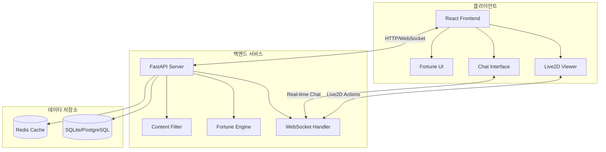

# 🔮 Fortune VTuber - Live2D 운세 애플리케이션

> **실시간 Live2D 캐릭터와 함께하는 인터랙티브 운세 상담 플랫폼**

<div align="center">
  
  
  
  
  
  
</div>

## 📖 프로젝트 개요

Fortune VTuber는 Live2D 기술을 활용한 차세대 운세 상담 플랫폼입니다. 사용자는 실시간으로 Live2D 캐릭터와 상호작용하며 개인화된 운세 서비스를 받을 수 있습니다.

### 🌟 주요 특징

- 🎭 **Live2D 캐릭터 통합**: 실시간 감정 표현과 모션 시스템
- 🔮 **다양한 운세 서비스**: 일일 운세, 타로 카드, 별자리 운세, 사주 기반 운세
- 💬 **실시간 채팅**: WebSocket 기반 Live2D 캐릭터와의 자연스러운 대화
- 🛡️ **안전한 콘텐츠**: 다층 필터링을 통한 건전한 대화 환경
- 📱 **반응형 디자인**: 모바일, 태블릿, 데스크톱 완벽 지원
- ⚡ **고성능**: 비동기 처리와 캐싱을 통한 빠른 응답 속도

### 🏗️ 아키텍처 개요



## 🚀 빠른 시작

### 📋 시스템 요구사항

- **Python**: 3.10 이상
- **Node.js**: 18 이상
- **메모리**: 최소 4GB (권장 8GB)
- **디스크**: 최소 2GB 여유 공간

### ⚡ 5분 설치

```bash
# 1. 저장소 클론
git clone https://github.com/your-org/fortune-vtuber.git
cd fortune-vtuber/project

# 2. 백엔드 설정
cd backend
python -m venv venv
source venv/bin/activate  # Windows: venv\Scripts\activate
pip install -e .

# 3. 데이터베이스 초기화
alembic upgrade head

# 4. 프론트엔드 설정
cd ../frontend
npm install

# 5. 개발 서버 시작
# 터미널 1: 백엔드
cd backend && python -m fortune_vtuber.main

# 터미널 2: 프론트엔드
cd frontend && npm start
```

### 🌐 서비스 접속

- **웹 애플리케이션**: http://localhost:3000
- **API 문서**: http://localhost:8080/docs
- **API 베이스**: http://localhost:8080/api/v1

## 🎯 주요 기능

### 1. 🔮 다양한 운세 서비스

#### 일일 운세
```javascript
const dailyFortune = await fetch('/api/v1/fortune/daily?birth_date=1995-03-15&zodiac=pisces');
```
- 개인 생년월일과 별자리 기반 맞춤 운세
- 연애, 금전, 건강, 업무 분야별 세부 운세
- 행운의 아이템, 숫자, 색깔 제공

#### 타로 카드 리딩
```javascript
const tarotReading = await fetch('/api/v1/fortune/tarot', {
  method: 'POST',
  body: JSON.stringify({
    question: "오늘 연애운은 어떨까요?",
    question_type: "love"
  })
});
```
- 3장 스프레드 (과거-현재-미래)
- 질문 유형별 맞춤 해석
- 실제 타로 카드 이미지 제공

#### 별자리 운세
```javascript
const zodiacFortune = await fetch('/api/v1/fortune/zodiac/pisces');
```
- 12성좌별 개인 특성 분석
- 별자리별 호환성 정보
- 일간/주간/월간 운세 지원

### 2. 🎭 Live2D 캐릭터 시스템

#### 감정 표현 시스템
- **8가지 기본 감정**: neutral, joy, thinking, concern, surprise, mystical, comfort, playful
- **상황별 자동 감정 매핑**: 운세 결과에 따른 적절한 감정 표현
- **부드러운 전환**: 자연스러운 감정 변화 애니메이션

#### 모션 시스템
- **인사**: greeting, farewell
- **운세 관련**: card_draw, crystal_gaze, blessing
- **상호작용**: thinking_pose, surprise, comfort
- **대기**: idle 모션 자동 재생

### 3. 💬 실시간 채팅 시스템

#### WebSocket 통신
```javascript
const ws = new WebSocket('ws://localhost:8080/ws/chat/session_id');

// 메시지 전송
ws.send(JSON.stringify({
  type: 'text_input',
  data: { message: '오늘 운세 봐주세요' }
}));

// 실시간 응답 수신
ws.onmessage = (event) => {
  const response = JSON.parse(event.data);
  // Live2D 액션, 텍스트 응답, 운세 결과 처리
};
```

#### 스마트 대화 처리
- **자연어 이해**: 사용자 의도 파악 및 적절한 응답
- **컨텍스트 유지**: 대화 맥락을 고려한 연속적 상호작용
- **멀티모달 응답**: 텍스트 + Live2D 액션 동시 제공

### 4. 🛡️ 콘텐츠 보안 시스템

#### 다층 필터링
- **키워드 필터**: 부적절한 단어 실시간 차단
- **컨텍스트 분석**: 문맥을 고려한 지능형 필터링
- **의도 분석**: 질문의 의도와 목적 파악
- **화이트리스트**: 운세 관련 허용 주제 관리

#### 안전 장치
- **Rate Limiting**: 남용 방지를 위한 요청 제한
- **세션 관리**: 익명 사용자 지원 및 세션 기반 추적
- **로깅**: 모든 상호작용 기록 및 모니터링

## 🏗️ 기술 스택

### 백엔드
- **웹 프레임워크**: FastAPI 0.115+
- **비동기 처리**: asyncio, uvicorn
- **데이터베이스**: SQLite (개발), PostgreSQL (프로덕션)
- **ORM**: SQLAlchemy 2.0+ (비동기)
- **마이그레이션**: Alembic
- **검증**: Pydantic 2.0+
- **캐싱**: Redis
- **WebSocket**: FastAPI WebSocket

### 프론트엔드
- **UI 프레임워크**: React 18+
- **상태 관리**: Context API + Hooks
- **HTTP 클라이언트**: Fetch API
- **WebSocket**: Native WebSocket API
- **Live2D**: Live2D Cubism SDK
- **스타일링**: CSS Modules + CSS Grid/Flexbox
- **빌드 도구**: Create React App

### 개발 도구
- **언어**: Python 3.10+, JavaScript ES2022+
- **패키지 관리**: pip, npm
- **코드 품질**: Black, ESLint, Prettier
- **테스팅**: pytest, Jest, Playwright
- **CI/CD**: GitHub Actions

## 📁 프로젝트 구조

```
fortune-vtuber/
├── 📁 project/
│   ├── 📁 backend/                 # FastAPI 백엔드
│   │   ├── 📁 src/fortune_vtuber/
│   │   │   ├── 📁 api/             # API 라우터
│   │   │   ├── 📁 models/          # 데이터베이스 모델
│   │   │   ├── 📁 services/        # 비즈니스 로직
│   │   │   ├── 📁 fortune/         # 운세 엔진
│   │   │   ├── 📁 live2d/          # Live2D 통합
│   │   │   ├── 📁 security/        # 보안 필터
│   │   │   ├── 📁 websocket/       # WebSocket 핸들러
│   │   │   └── 📁 config/          # 설정 관리
│   │   ├── 📁 alembic/             # 데이터베이스 마이그레이션
│   │   ├── 📁 tests/               # 테스트 코드
│   │   └── 📁 static/              # 정적 파일 (Live2D 모델)
│   │
│   ├── 📁 frontend/                # React 프론트엔드
│   │   ├── 📁 src/
│   │   │   ├── 📁 components/      # React 컴포넌트
│   │   │   ├── 📁 services/        # API 클라이언트
│   │   │   ├── 📁 utils/           # 유틸리티 함수
│   │   │   └── 📁 tests/           # 프론트엔드 테스트
│   │   └── 📁 public/              # 정적 자원
│   │
│   └── 📁 docs/                    # 프로젝트 문서
│       ├── 📄 testing-guide.md     # 테스트 가이드
│       ├── 📄 deployment-guide.md  # 배포 가이드
│       ├── 📄 api-usage-guide.md   # API 사용법
│       └── 📄 troubleshooting.md   # 문제 해결
│
├── 📁 reference/                   # 참고 자료
│   └── 📁 Open-LLM-VTuber/        # 기반 프로젝트
│
└── 📄 README.md                    # 이 파일
```

## 📚 문서 가이드

### 🧪 개발자 가이드
- **[테스트 가이드](docs/testing-guide.md)**: 단위/통합/E2E 테스트 전략
- **[API 사용법](docs/api-usage-guide.md)**: RESTful API 및 WebSocket 사용법
- **[문제 해결](docs/troubleshooting.md)**: 일반적인 문제 및 해결 방법

### 🚀 운영 가이드
- **[배포 가이드](docs/deployment-guide.md)**: 개발/스테이징/프로덕션 배포
- **[보안 가이드](backend/docs/security-architecture.md)**: 보안 정책 및 구현
- **[데이터베이스 스키마](backend/docs/database-schema.md)**: 데이터 모델 설계

## 🔧 개발 환경 설정

### 백엔드 개발

```bash
# 가상환경 생성 및 활성화
cd project/backend
python -m venv venv
source venv/bin/activate

# 개발 의존성 설치
pip install -e ".[dev]"

# 개발 서버 실행 (핫 리로드)
uvicorn fortune_vtuber.main:app --reload --host 0.0.0.0 --port 8080

# 테스트 실행
pytest tests/ -v --cov=src

# 코드 포맷팅
black src tests
isort src tests

# 타입 체킹
mypy src
```

### 프론트엔드 개발

```bash
# 의존성 설치
cd project/frontend
npm install

# 개발 서버 실행
npm start

# 테스트 실행
npm test

# 빌드
npm run build

# 코드 린팅
npm run lint
npm run lint:fix
```

### 환경 변수 설정

#### 백엔드 (.env)
```bash
# 서버 설정
HOST=0.0.0.0
PORT=8080
DEBUG=True
ENVIRONMENT=development

# 데이터베이스
DATABASE_URL=sqlite:///./fortune_vtuber.db

# 보안
SECRET_KEY=your-secret-key-here
SESSION_TIMEOUT_HOURS=2

# CORS
CORS_ORIGINS=["http://localhost:3000"]

# 로깅
LOG_LEVEL=DEBUG
LOG_FILE=logs/fortune_vtuber.log

# 캐싱
CACHE_TYPE=memory
CACHE_TTL_SECONDS=3600

# Rate Limiting
RATE_LIMIT_PER_MINUTE=60
FORTUNE_RATE_LIMIT_PER_HOUR=10
```

#### 프론트엔드 (.env)
```bash
REACT_APP_API_BASE_URL=http://localhost:8080
REACT_APP_WS_BASE_URL=ws://localhost:8080
REACT_APP_LIVE2D_MODEL_PATH=/static/live2d/
```

## 🧪 테스트

### 테스트 실행

```bash
# 백엔드 테스트
cd project/backend
pytest tests/ -v --cov=src --cov-report=html

# 프론트엔드 테스트
cd project/frontend
npm test -- --coverage

# E2E 테스트
npx playwright test
```

### 테스트 커버리지 목표
- **백엔드**: 코드 커버리지 ≥ 80%
- **프론트엔드**: 코드 커버리지 ≥ 75%
- **API 테스트**: 모든 엔드포인트 커버
- **E2E 테스트**: 주요 사용자 플로우 커버

## 🚀 배포

### 개발 환경 배포

```bash
# Docker Compose 사용
docker-compose -f docker-compose.dev.yml up -d

# 수동 배포
./scripts/deploy-dev.sh
```

### 프로덕션 환경 배포

```bash
# 단계별 배포
./scripts/deploy-production.sh

# 무중단 배포 (Blue-Green)
./scripts/blue-green-deploy.sh

# 롤백
./scripts/rollback.sh [version]
```

### Docker 배포

```bash
# 이미지 빌드
docker build -t fortune-vtuber/backend:latest ./backend
docker build -t fortune-vtuber/frontend:latest ./frontend

# 컨테이너 실행
docker-compose -f docker-compose.prod.yml up -d
```

## 📊 모니터링 및 로깅

### 주요 메트릭
- **API 응답 시간**: 95th percentile < 200ms
- **WebSocket 지연**: 평균 < 100ms
- **에러율**: < 0.1%
- **가용성**: > 99.9%

### 로그 레벨
- **DEBUG**: 개발 환경 디버깅
- **INFO**: 일반 정보 (사용자 액션, API 호출)
- **WARNING**: 주의 필요 (제한 초과, 비정상 패턴)
- **ERROR**: 오류 발생 (예외, 실패)
- **CRITICAL**: 치명적 오류 (서비스 중단)

## 🤝 기여하기

### 기여 방법

1. **Fork** 프로젝트를 포크합니다
2. **Branch** 기능 브랜치를 생성합니다
   ```bash
   git checkout -b feature/amazing-feature
   ```
3. **Commit** 변경사항을 커밋합니다
   ```bash
   git commit -m 'Add amazing feature'
   ```
4. **Push** 브랜치에 푸시합니다
   ```bash
   git push origin feature/amazing-feature
   ```
5. **Pull Request** 를 생성합니다

### 개발 가이드라인

#### 코드 스타일
- **Python**: PEP 8, Black 포매터 사용
- **JavaScript**: ESLint + Prettier 설정 준수
- **커밋 메시지**: [Conventional Commits](https://www.conventionalcommits.org/) 형식

#### 브랜치 전략
- **main**: 프로덕션 릴리스
- **develop**: 개발 통합 브랜치
- **feature/***: 새 기능 개발
- **bugfix/***: 버그 수정
- **hotfix/***: 긴급 수정

#### PR 요구사항
- [ ] 관련 이슈 링크
- [ ] 테스트 추가/수정
- [ ] 문서 업데이트
- [ ] 코드 리뷰 통과
- [ ] CI/CD 파이프라인 통과

## 🐛 버그 리포트

버그를 발견하셨나요? [GitHub Issues](https://github.com/your-org/fortune-vtuber/issues)에 다음 정보와 함께 리포트해주세요:

- **환경 정보**: OS, Python/Node.js 버전
- **재현 단계**: 상세한 재현 방법
- **예상 결과**: 어떤 동작을 기대했는지
- **실제 결과**: 실제로 어떤 일이 발생했는지
- **로그**: 관련 에러 로그 (민감한 정보 제외)

## 💡 기능 제안

새로운 기능을 제안하고 싶으시나요? [GitHub Discussions](https://github.com/your-org/fortune-vtuber/discussions)에서 다음을 포함하여 제안해주세요:

- **기능 설명**: 제안하는 기능의 상세 설명
- **사용 사례**: 어떤 상황에서 필요한지
- **기대 효과**: 이 기능으로 얻을 수 있는 이점
- **구현 아이디어**: 가능한 구현 방법 (선택사항)

## 📈 로드맵

### 🎯 v1.1 (2025년 Q3)
- [ ] 음성 인터랙션 지원
- [ ] 다국어 지원 (영어, 일본어)
- [ ] 모바일 앱 (React Native)
- [ ] 고급 타로 스프레드 (켈트십자 등)

### 🎯 v1.2 (2025년 Q4)
- [ ] AI 기반 개인화 추천
- [ ] 소셜 기능 (운세 공유)
- [ ] 커스텀 Live2D 캐릭터
- [ ] 프리미엄 구독 모델

### 🎯 v2.0 (2026년 Q1)
- [ ] VR/AR 지원
- [ ] 3D 캐릭터 모델
- [ ] 실시간 멀티플레이어
- [ ] 블록체인 기반 NFT 타로카드

## 📄 라이선스

이 프로젝트는 [MIT 라이선스](LICENSE)를 따릅니다.

```
MIT License

Copyright (c) 2025 Fortune VTuber Team

Permission is hereby granted, free of charge, to any person obtaining a copy
of this software and associated documentation files (the "Software"), to deal
in the Software without restriction, including without limitation the rights
to use, copy, modify, merge, publish, distribute, sublicense, and/or sell
copies of the Software, and to permit persons to whom the Software is
furnished to do so, subject to the following conditions:

The above copyright notice and this permission notice shall be included in all
copies or substantial portions of the Software.

THE SOFTWARE IS PROVIDED "AS IS", WITHOUT WARRANTY OF ANY KIND, EXPRESS OR
IMPLIED, INCLUDING BUT NOT LIMITED TO THE WARRANTIES OF MERCHANTABILITY,
FITNESS FOR A PARTICULAR PURPOSE AND NONINFRINGEMENT. IN NO EVENT SHALL THE
AUTHORS OR COPYRIGHT HOLDERS BE LIABLE FOR ANY CLAIM, DAMAGES OR OTHER
LIABILITY, WHETHER IN AN ACTION OF CONTRACT, TORT OR OTHERWISE, ARISING FROM,
OUT OF OR IN CONNECTION WITH THE SOFTWARE OR THE USE OR OTHER DEALINGS IN THE
SOFTWARE.
```

## 🙏 감사의 말

이 프로젝트는 다음 오픈소스 프로젝트들의 영감을 받았습니다:

- **[Open-LLM-VTuber](https://github.com/t41372/Open-LLM-VTuber)**: Live2D VTuber 기반 아키텍처
- **[Live2D Cubism SDK](https://www.live2d.com/)**: Live2D 캐릭터 렌더링
- **[FastAPI](https://fastapi.tiangolo.com/)**: 고성능 웹 API 프레임워크
- **[React](https://reactjs.org/)**: 사용자 인터페이스 라이브러리

특별히 [Open-LLM-VTuber](https://github.com/t41372/Open-LLM-VTuber) 프로젝트의 혁신적인 Live2D 통합 아이디어와 구현에 깊은 감사를 표합니다.

## 👥 개발팀

- **Project Lead**: [Your Name](https://github.com/your-username)
- **Backend Developer**: [Backend Dev](https://github.com/backend-dev)
- **Frontend Developer**: [Frontend Dev](https://github.com/frontend-dev)
- **Live2D Specialist**: [Live2D Expert](https://github.com/live2d-expert)

## 📞 연락처

- **이메일**: contact@fortune-vtuber.com
- **GitHub**: [@fortune-vtuber](https://github.com/fortune-vtuber)
- **Twitter**: [@FortuneVTuber](https://twitter.com/FortuneVTuber)
- **Discord**: [Fortune VTuber Community](https://discord.gg/fortune-vtuber)

---

<div align="center">
  <h3>🌟 실시간 Live2D 캐릭터와 함께하는 특별한 운세 경험을 만들어보세요! 🌟</h3>
  
  <p>
    <a href="https://fortune-vtuber.com">🌐 라이브 데모</a> •
    <a href="docs/api-usage-guide.md">📚 API 문서</a> •
    <a href="docs/deployment-guide.md">🚀 배포 가이드</a> •
    <a href="docs/troubleshooting.md">🛠️ 문제 해결</a>
  </p>
  
  <p>
    <strong>Made with ❤️ by Fortune VTuber Team</strong>
  </p>
</div>